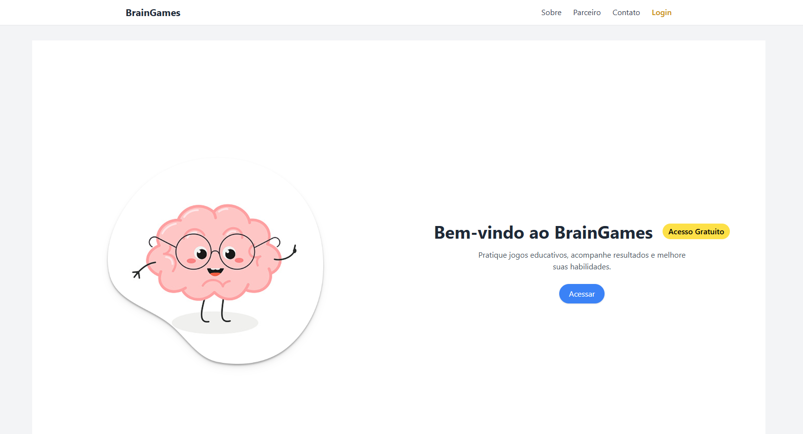
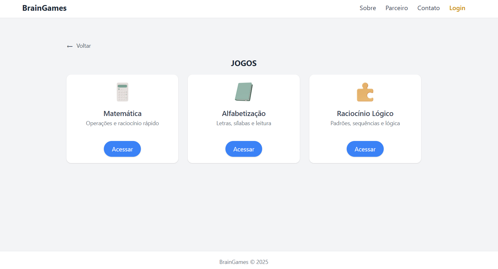
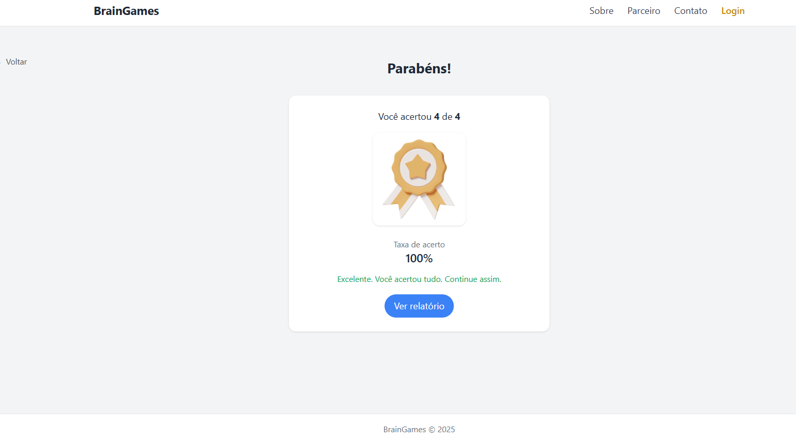

# 🎮 BrainGames — Plataforma de Jogos Educacionais com Propósito Social

🔗 **Acesse o projeto online:**  
https://brain-games-app-mu.vercel.app/

O **BrainGames** é uma plataforma digital desenvolvida como projeto do PIME (Projeto Integrador Multidisciplinar) do curso de ADS — Belas Artes, com foco em **inclusão educacional**, **gamificação** e **desenvolvimento cognitivo** de crianças entre 7 e 12 anos.

O sistema foi projetado especialmente para instituições sociais que necessitam de ferramentas simples, leves e gratuitas para apoiar processos pedagógicos.

---

## 🚀 Tecnologias Utilizadas

- **React.js** — frontend leve e rápido  
- **JavaScript** — linguagem principal  
- **TailwindCSS** — estilização responsiva  
- **Firebase (planejado)**  
  - Auth  
  - Firestore  
  - Storage  
- **Vercel** — hospedagem do MVP  
- **Figma** — prototipação  

---

## 📱 Funcionalidades Principais

- Menu com jogos cognitivos  
- Feedback educativo imediato  
- Registro de desempenho  
- Relatórios individuais e por turma  
- Interface acessível e responsiva  
- Página da entidade parceira  
- Mensagens motivadoras  
- Testes preliminares com crianças (Sprint 2)  

---

## 🧩 Estrutura das Telas

- Tela Inicial  
- Login  
- Menu  
- Jogos  
- Resultado  
- Relatório  
- Sobre  
- Parceiro  
- Contato  

---

## 🖼️ Screenshots

### Tela Inicial


### Jogo


### Relatório


---

## 🛠️ Como Executar o Projeto Localmente

### 1. Clonar o repositório
```bash
git clone https://github.com/SEU_USUARIO/SEU_REPOSITORIO.git
